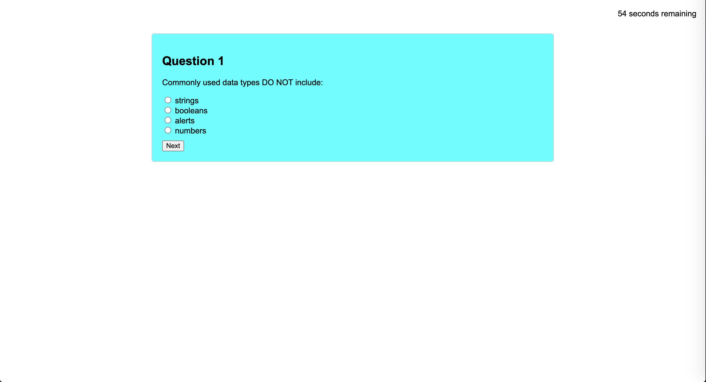
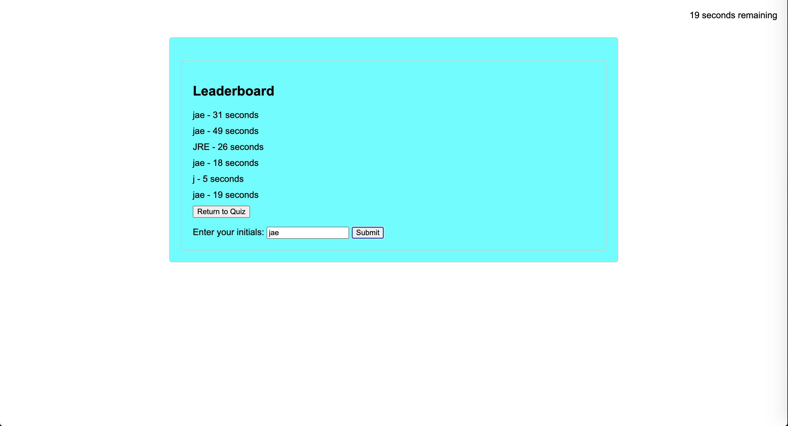

# <JavaScript Basics Quiz>

## JavaScript Quiz

## Description

A simple, five quiestion, quiz made to test a users understanding of basic JavaScript concepts. It features a timer that will count down from sixty and if a users gets an answer "wrong" ten seconds will be subtracted from the timer. At the end of the quiz, a leaderboard will display showing the user their time as well as a place for their initials (max 3). The leaderboard will save locally.

## Screenshots

## Usage

To use this web application you can follow this link to the page: 

Once the webpage has loaded, simply click the "Start Quiz" button to begin the quiz and start the timer. The quiz is a multiple choice type quiz where you must select an answer and press the "next" button. Before moving on, the page will tell you whether or not you got the question "correct" or "wrong," subracting 10 seconds for each wrong answer. Once the final question is answered, the quiz will finish and a leaderboard will appear displaying your time as well as a place to submit your initials. From there you may choose to leave the page, or "return to quiz" to try again.

## Credits 

N/A

## Liscense

[MIT](https://choosealicense.com/licenses/mit/)
